# Архитектура в С4 нотации

## Контекстная диаграмма

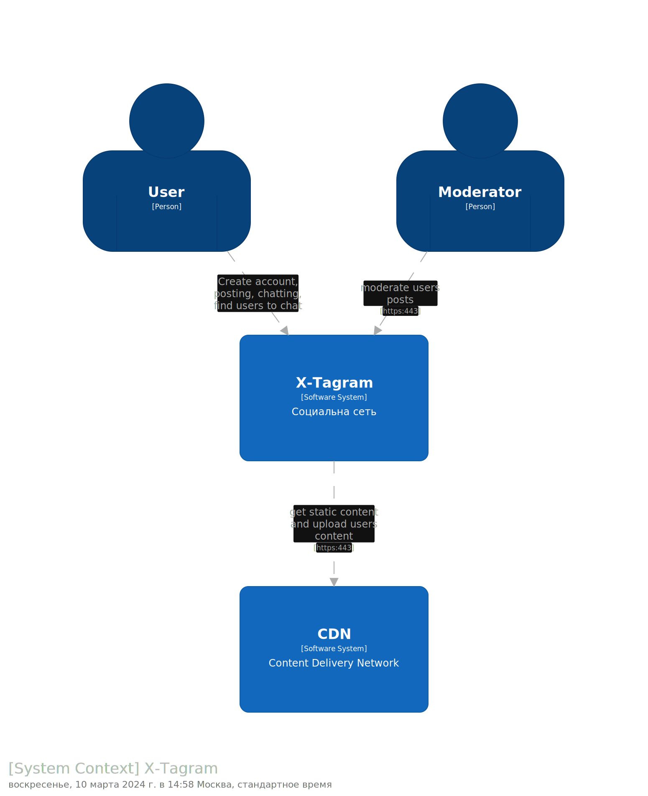
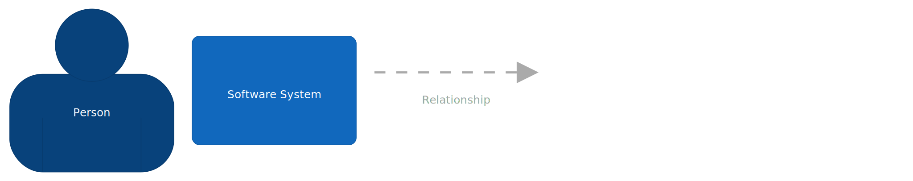

## Диаграмма контейнеров

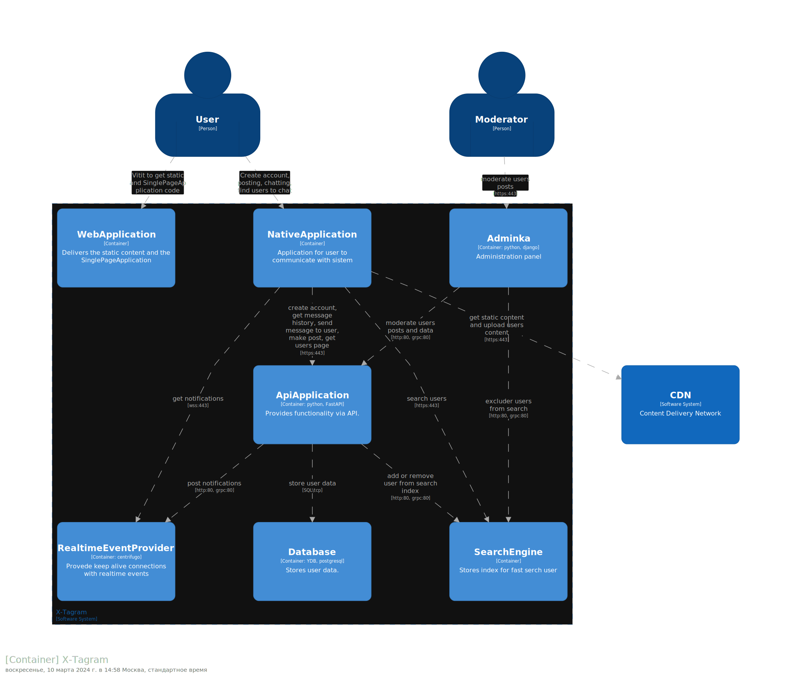
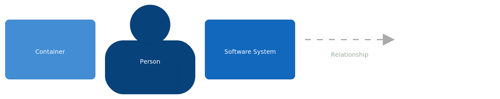

### Диаграмма компонентов

#### Контейнер SearchEngine
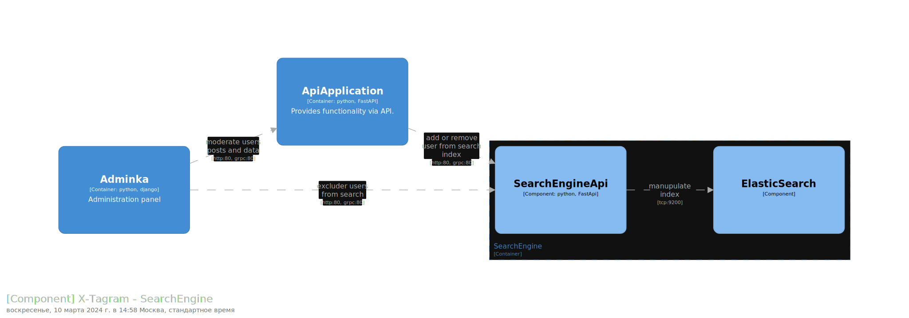
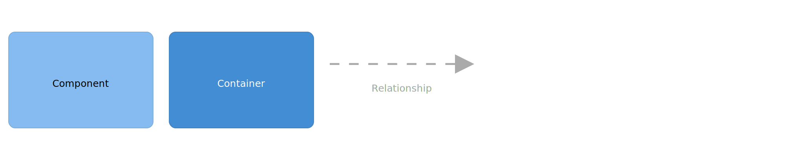

#### Контейнер SearchEngine
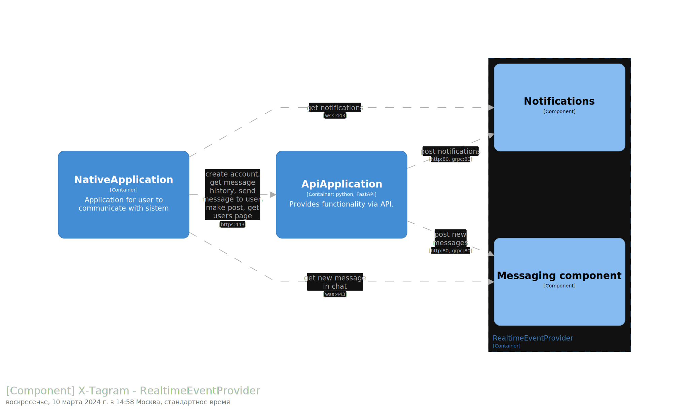


### Диаграмма развертывания
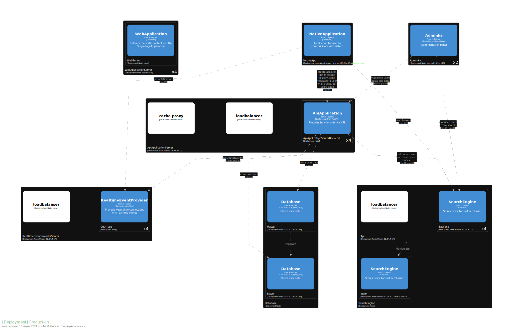
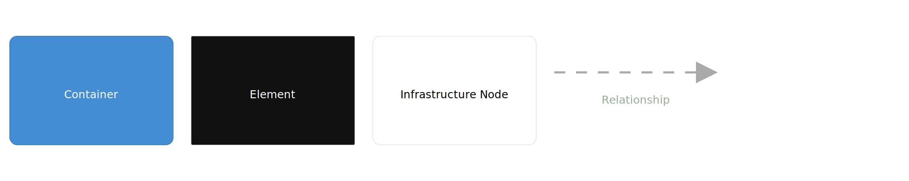

### Динамические диаграммы

#### Создание нового пользователя
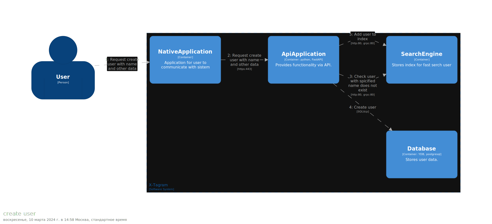
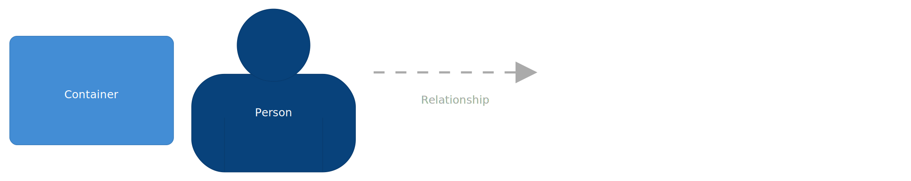

#### Поиск пользователя по логину или маске имя и фамилии
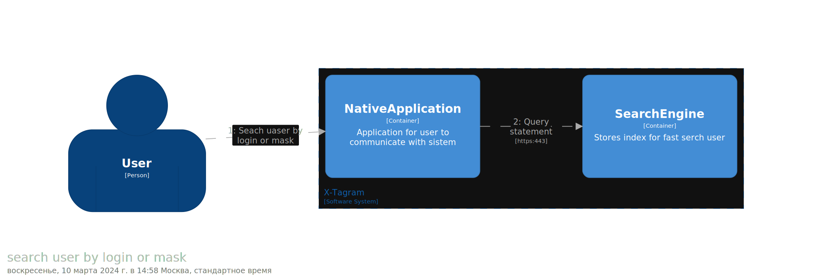


#### Отправка сообщения пользователю
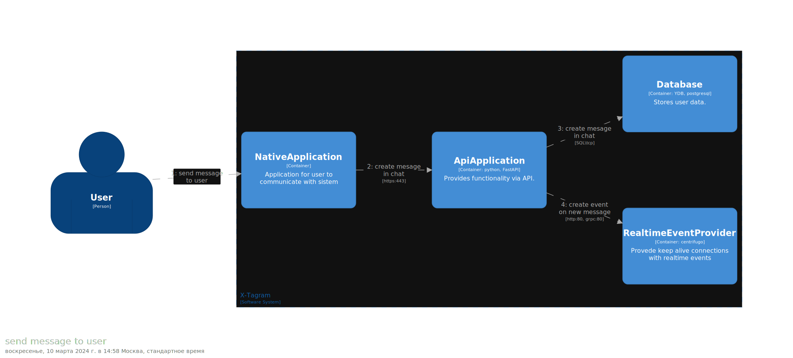


# Локальный запуск structurizr

```console
docker compose up
```